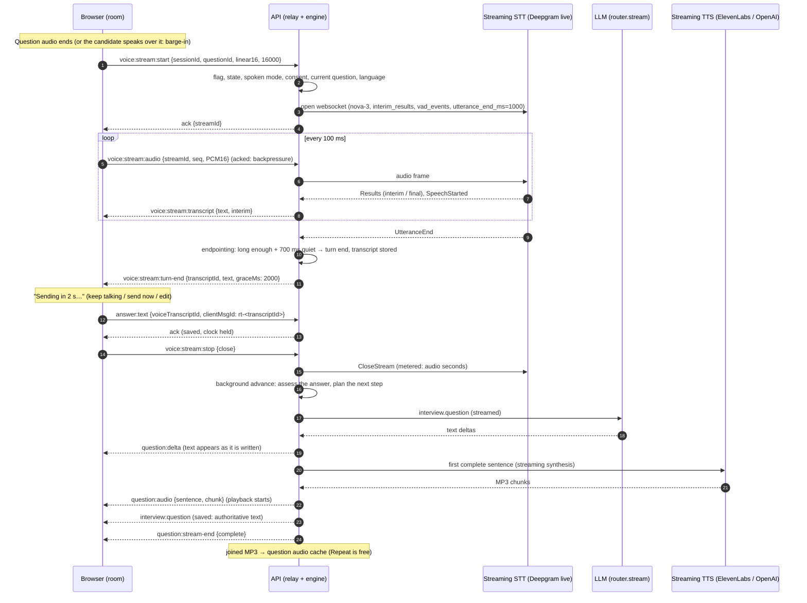

# Voice interviews (Phase 7)

In a voice interview the candidate answers by speaking and hears each question read aloud. The pipeline is **cascaded** and controlled by the interview engine (decision D4):

```text
question (engine) → text-to-speech → candidate hears it
candidate speaks → recorded answer → speech-to-text → transcript = the answer → engine
```

The engine, the question ledger, the planner and the time budget are exactly the same as in a text interview. Voice only changes how questions are delivered and how answers arrive.

Answers are recorded with push-to-talk by default. With the `voice.realtime` flag the same pipeline streams: see [Realtime conversational voice](#realtime-conversational-voice-flag-voicerealtime).

- Contracts: [`packages/shared-types/src/voice.ts`](../../packages/shared-types/src/voice.ts)
- Adapters (Deepgram, OpenAI, ElevenLabs, mock): [`packages/provider-adapters/src/speech/`](../../packages/provider-adapters/src/speech/)
- Routing and metering: `transcribe` / `synthesize` / `routeStatus` in [`packages/ai-core/src/router.ts`](../../packages/ai-core/src/router.ts)
- API: [`apps/api/src/modules/voice/`](../../apps/api/src/modules/voice/)

## Speech providers

Speech goes through the same AI router as the LLM features. It has fallback chains, per-model retries, circuit breakers, cross-replica concurrency slots and usage metering with a price snapshot.

| Feature    | Default chain                                                                   | Metered by    |
| ---------- | ------------------------------------------------------------------------------- | ------------- |
| `stt.live` | Deepgram `nova-3` → OpenAI `gpt-4o-mini-transcribe` (→ `mock-stt` in dev)       | audio seconds |
| `tts.live` | ElevenLabs `eleven_flash_v2_5` → OpenAI `gpt-4o-mini-tts` (→ `mock-tts` in dev) | characters    |

- Admins manage providers, keys, models, voice ids (`params.voice` on TTS models), prices and chains in the console. **Test** on a speech model synthesizes a phrase (TTS) or transcribes one second of silence (STT).
- The interview language (`hi`, `te`, `en`) is passed as a hint. `auto` lets the model detect the language. If a model rejects a language (HTTP 400), the router moves on to the next model in the chain.
- `GET /voice/health` reports each feature as `AVAILABLE` (first choice usable), `DEGRADED` (only fallbacks are usable, but voice still works) or `UNAVAILABLE`. It works from configuration and circuit state and makes no provider calls.

## Before the interview

1. **Setup:** the candidate chooses Voice. VOICE is in `AVAILABLE_INTERVIEW_MODES`, and the template must list it.
2. **Device check** (browser): support for MediaRecorder and the chosen audio format, microphone permission and input level, a speaker test tone, a network round trip, and speech service status. The results are posted to `POST /interviews/:id/device-check`. Microphone and recorder are required, and a FAIL on either blocks the start. The check is valid for 24 hours.
3. **Consent:** the candidate accepts the voice processing notice through the generic consent endpoints (`GET`/`POST /interviews/:id/consents`, Phase 8). The texts are versioned and every decision is recorded and audited. See [media-and-consent.md](media-and-consent.md).
4. **Start:** the session stays `READY` while the check and consent are recorded, so the candidate can still switch to text. `POST /start` then walks the state machine through `DEVICE_CHECK → CONSENT_REQUIRED → READY_TO_START → ACTIVE` in one transaction. It refuses with a specific message if anything is missing.

## During the interview

**Questions.** When a question is asked in voice mode, the API starts synthesizing it straight away.

- The room fetches the audio from `GET /interviews/:id/questions/:questionId/audio` with its bearer token and plays it. The question text stays on screen as captions.
- Audio is cached in Redis for 2 hours, and concurrent requests share one synthesis. Replaying a question therefore costs nothing.
- One synthesis per question **across API replicas**: the first replica to ask takes a short Redis lock (`cbi:voice:tts-lock:<question>`, 20 s, released by token) and synthesizes; the others poll the cache and read its result. If the holder fails (its lock goes without a result) or outlasts the lock, a waiter synthesizes itself. Within a process, concurrent requests share one promise. When Redis is down, each replica synthesizes on its own.

**Answers.**

1. The browser records the answer with MediaRecorder: WebM/Opus, Ogg/Opus or MP4. There is a maximum of 5 minutes per answer: the recorder stops itself there, once (the elapsed-time tick is cleared as soon as a stop begins, so a slow `onstop` cannot start a second finish).
2. On **Done**, it uploads the recording to `POST /interviews/:id/voice/transcribe`. The API checks that:
   - this is the current, unanswered question and the interview is in voice mode;
   - the recording is at least 500 ms and at most 10 MB;
   - the container is audio, detected from the bytes. The declared type is ignored.

   **Duration is measured on the server.** Speech usage and cost are billed by duration, and some models (OpenAI) report none, so the browser's `durationMs` is not trusted. `audio-duration.ts` reads the container: WebM (the declared Duration, or the last block's timestamp, since MediaRecorder writes none), Ogg (the last granule position, less Opus' pre-skip), MP4 (`mvhd`, or the sum of the fragments that Safari writes) and WAV. When it can't read the file (MP3, or a damaged file) it uses the browser's value, bounded by what the bytes can hold at 6 kbit/s (Opus' floor). Either way the result is capped at 5 minutes. A provider's own reported duration still wins.

3. The transcript comes back for review with a `lowConfidence` hint. It is also stored server-side for 1 hour.
4. **Submit** sends `answer:text` with the `voiceTranscriptId`. The **server's transcript becomes the answer**, whatever text the client sends.
5. The turn records `source: 'VOICE'` and the speech metadata: duration, language, confidence and model.

**Degrade to text.** When every model in the STT or TTS chain fails:

- the request answers **503 `SPEECH_UNAVAILABLE`**, and the room receives `interview:degraded` `{ kind, options }`;
- the candidate can retry, continue reading the questions (TTS), or **switch to typing** with `POST /interviews/:id/mode`;
- the state, clock, ledger and questions are untouched;
- the switch is recorded in `voice.modeHistory`, audited, and broadcast as `interview:mode`;
- an interview that was set up for voice can switch back.

## Realtime conversational voice (flag `voice.realtime`)

With the `voice.realtime` feature flag on for a candidate (stable per-user rollout, admin console → Feature flags), a voice or video interview becomes a conversation: the answer is transcribed while the candidate speaks, the server decides when it is complete, and the next question is shown and spoken while it is being written. It is still the cascade of D4 and the engine still owns turns, the ledger and the clock: a streamed answer is submitted through the ordinary `answer:text` path, and a streamed question only becomes the question once it is saved.

Push-to-talk (above) stays, and takes over automatically when:

- the flag is off, or the browser lacks AudioWorklet or Web Audio (older Safari, some in-app browsers);
- the interview language cannot be streamed (Telugu, see below): the server answers `UNSUPPORTED` and the room keeps push-to-talk for the whole interview;
- every streaming speech model fails (`SPEECH_UNAVAILABLE`), the link is too slow (the browser's audio queue overflows, or frames arrive faster than 1.5× real time), or the microphone cannot be opened. These fall back for the current question; the next one tries realtime again;
- the candidate chooses "Use the record button instead".

Coding questions are answered in the editor as before (their text and audio are still delivered).

### Sequence



### Latency budget

Target: the next question starts speaking within **2.5 s (p50)** of the moment the answer is submitted, and the whole turn stays within D4's 1.5–3 s of conversation latency on top of the time the candidate controls (the grace window).

| Stage                                                 | Budget (p50)                                             | Measured as (`cbi_voice_turn_latency_seconds{stage}`) |
| ----------------------------------------------------- | -------------------------------------------------------- | ----------------------------------------------------- |
| Last word → provider end of utterance                 | ~1.0 s (`utterance_end_ms`)                              | part of `endpoint`                                    |
| End of utterance → turn end (quiet spell)             | 0.7 s                                                    | part of `endpoint`                                    |
| Grace window (candidate's time; 0 with "Send now")    | 2.0 s                                                    | —                                                     |
| Answer saved → assessment (`interview.assessTurn`)    | 0.6–1.2 s                                                | part of `answer_to_first_token`                       |
| Assessment → first question token (`router.stream()`) | 0.3–0.6 s                                                | `answer_to_first_token`                               |
| First sentence complete → first audio byte (TTS)      | 0.2–0.5 s (Flash v2.5 ~75 ms)                            | `answer_to_first_audio`                               |
| Socket delivery + playback start in the browser       | ~0.1 s                                                   | —                                                     |
| **End of speech → first audio byte**                  | **~4–5 s with the grace window, ~2–3 s with "Send now"** | `speech_to_first_audio`                               |

Every turn also logs one `voice turn latency` line (session, question and each stage in ms). The numbers above are estimates from the providers' published figures: they have not been measured with real providers yet (only the mocks run in CI). Watch `speech_to_first_audio` and `answer_to_first_audio` after enabling the flag for a small percentage. The largest single cost is the assessment call, which runs before the next question because the planner needs its verdict; the grace window is deliberately the candidate's.

### Protocol (Socket.IO `/rt`, in addition to the table in live-interview.md)

| Direction | Event                     | Payload                                                           | Notes                                                                                    |
| --------- | ------------------------- | ----------------------------------------------------------------- | ---------------------------------------------------------------------------------------- |
| C→S       | `voice:stream:start`      | `{sessionId, questionId, encoding: linear16, sampleRate, resume}` | Ack `{stream: {streamId, resumedText, graceMs}}` or `UNSUPPORTED` / `SPEECH_UNAVAILABLE` |
| C→S       | `voice:stream:audio`      | `{streamId, seq, audio}` (binary, ≤ 16 KB)                        | Acked; the browser keeps ≤ 20 frames (2 s) in flight                                     |
| C→S       | `voice:stream:stop`       | `{streamId, action: send \| cancel \| close}`                     | `send`: flush and end the turn now; `close`: answered; `cancel`: discard                 |
| C→S       | `voice:barge-in`          | `{sessionId, questionId}`                                         | Stops synthesizing the rest of the question (metrics)                                    |
| S→C       | `voice:stream:transcript` | `{streamId, questionId, text, interim}`                           | The owning socket only                                                                   |
| S→C       | `voice:stream:speech`     | `{streamId}`                                                      | Provider speech start: restarts the grace countdown                                      |
| S→C       | `voice:stream:turn-end`   | `{streamId, transcriptId, text, reason, graceMs, lowConfidence}`  | `reason`: silence, requested, limit                                                      |
| S→C       | `voice:stream:resumed`    | `{streamId}`                                                      | Words after a turn end: the turn reopens                                                 |
| S→C       | `voice:stream:error`      | `{streamId, code}`                                                | `SPEECH_UNAVAILABLE`, `RATE`, `LIMIT`, `INTERNAL`                                        |
| S→C       | `question:delta`          | `{questionId, seq, text}`                                         | Room-wide preview; `interview:question` is authoritative                                 |
| S→C       | `question:audio`          | `{questionId, sentence, chunk, mimeType, audio, last}`            | Room-wide                                                                                |
| S→C       | `question:stream-end`     | `{questionId, audio: complete \| failed \| none}`                 | `failed` / `none`: the room fetches the question audio as usual                          |

Contracts: [`packages/shared-types/src/voice-realtime.ts`](../../packages/shared-types/src/voice-realtime.ts).

### How it works

**Capture (browser).** `public/pcm-tap.worklet.js` (an AudioWorklet served from the site, because the CSP's `script-src`, which covers worklets, allows `'self'` only) copies each render quantum to the page; `pcm.ts` averages it down to 16 kHz PCM16 and cuts 100 ms frames. The microphone stays open while realtime voice runs (echo cancellation on). While the interviewer speaks only the local voice detector sees the frames.

**Barge-in.** `energy-vad.ts` follows the room's noise floor and reports speech after 250 ms clearly above it (a click or a cough does not count; a steady fan slowly becomes the floor). Speaking over the question stops its audio at once, tells the server to stop synthesizing the rest, marks the question as delivered (its text is on screen) and starts the answer with the last half second of audio, so the first words are not lost. If the question is still being written, audio is queued until it is saved. During the grace window the provider's `SpeechStarted` restarts the countdown.

**Relay and endpointing (API).** `stream-relay.ts` opens one provider stream per socket through `router.openTranscriptionStream` (the `stt.live` chain; models without streaming are skipped; fallback happens only while connecting). Frames are acknowledged; an ack is held while the provider connection is backed up. `endpointing.ts` decides the end of the answer: a provider end-of-utterance or speech-final makes it possible, but only an answer of at least 3 words and 1.2 s of speech ends after 700 ms of quiet; a shorter one ends after 6 s of quiet (or with "Send now"). Words after a turn end reopen it. The turn end stores the transcript exactly like a push-to-talk one (`cbi:voice:transcript:*`, bound to user, session and question), so the answer path is unchanged: the server's transcript is the answer.

**Review and editing.** The candidate can tick "Let me review my answer before it is sent" (kept in this browser), and an unclear or empty transcript always waits for review. "Edit" lets them correct the text: the answer is then sent with `voiceEdited: true`, stored as the candidate's text with the speech metadata marked `voice.edited`. Evaluation already treats spoken answers as "spoken, automatically transcribed".

**Questions.** When the flag is on for a spoken interview, `advance` (the background step after the answer's acknowledgement) generates the question with `router.stream()`; `question-text.ts` releases the text inside the `{"question": …}` reply as it arrives (plain text is accepted too) and validates the whole reply like the non-streamed path. An unusable stream falls back to the ordinary call (or the templated fallback question); the saved text then replaces the preview and nothing more is spoken from the stream. `sentences.ts` cuts the text into sentences (abbreviations, decimals and initials do not end one; Hindi's danda does; very short sentences are joined), and `question-speaker.ts` synthesizes them in order with `router.synthesizeStream`, relaying MP3 chunks. When every sentence was spoken the joined MP3 is written to the question audio cache, so "Repeat" and a reload cost nothing. A streamed question skips the usual audio warm-up, so it is synthesized once.

**Playback (browser).** `stream-player.ts` appends MP3 chunks to a MediaSource (sequence mode) so the first sentence plays at once; without MediaSource for MP3 (and for the mock's WAV) each sentence is decoded with Web Audio and queued.

**Reconnects.** A dropped socket closes the provider stream (and meters it) and keeps the text so far in Redis (`cbi:voice:partial:*`, 10 minutes). The room pauses the answer, showing the text; when the socket is back it reopens the stream with `resume: true` and carries on from the server's partial, or the candidate edits it. An answer that had already ended waits for review instead of being sent. Submissions are idempotent: `clientMsgId` is derived from the transcript id, a resend is acknowledged as a duplicate, and the room submits each transcript once.

**Metering.** A stream is metered once, when it closes: audio seconds (the provider's reported duration, otherwise the bytes sent at 16 kHz PCM16), with the price snapshot, including streams that failed midway (the provider bills the audio). Streamed synthesis is metered by characters per sentence, including a sentence stopped by a barge-in once audio was produced. An open stream holds no router concurrency slot (its length is the candidate's).

### Languages and provider limits

| Interview language | Realtime transcription                                                | Notes                                                                                                                                                                                                                                                                                                                           |
| ------------------ | --------------------------------------------------------------------- | ------------------------------------------------------------------------------------------------------------------------------------------------------------------------------------------------------------------------------------------------------------------------------------------------------------------------------- |
| English            | Deepgram nova-3 `language=en`, endpointing 300 ms                     |                                                                                                                                                                                                                                                                                                                                 |
| Hindi              | Deepgram nova-3 `language=multi` (code-switching), endpointing 100 ms | `multi` covers Hindi and English mixed in one answer (Deepgram's recommended 100 ms endpointing for code-switching).                                                                                                                                                                                                            |
| Telugu             | **Not streamed: push-to-talk**                                        | Deepgram added a monolingual nova-3 Telugu model in January 2026, but Telugu is not part of the `multi` code-switching set, and Telugu answers are usually mixed with English. The batch chain (OpenAI `gpt-4o-mini-transcribe` as fallback) handles mixed speech better. Revisit when Deepgram's code-switching covers Telugu. |

- Questions are streamed and spoken in every language (TTS streaming does not depend on the STT language): ElevenLabs `POST /v1/text-to-speech/{voice}/stream` (`language_code` for v2.5 models) and OpenAI `POST /v1/audio/speech` with `stream_format: "audio"`.
- Only Deepgram (and the mock) stream in the default `stt.live` chain; OpenAI transcription is batch-only here, so it is skipped (`streaming_unsupported`) for realtime and stays the push-to-talk fallback.
- Provider keys never leave the API: the browser streams to the API over the interview socket, and the API holds the Deepgram websocket (key in the `Sec-WebSocket-Protocol` header).
- Echo: the browser's echo cancellation keeps the question audio out of the microphone on most devices. Speakers played loudly without headphones can still trigger a barge-in; the question text stays on screen, and "Repeat" replays it.

### Metrics and logs

| Metric                           | Labels                                                                                                        |
| -------------------------------- | ------------------------------------------------------------------------------------------------------------- |
| `cbi_voice_turn_latency_seconds` | `stage`: endpoint, speech_to_first_token, speech_to_first_audio, answer_to_first_token, answer_to_first_audio |
| `cbi_voice_stt_streams`          | open streams on this process                                                                                  |
| `cbi_voice_stream_events_total`  | `event`: opened, turn_end, resumed, fallback, rate_limited, barge_in                                          |

Provider calls also appear in `cbi_ai_call_duration_seconds` (features `stt.live`, `tts.live`, `interview.question`) through the usual usage observer.

### Rollout

1. Turn on `voice.realtime` for a small percentage (the rollout is stable per candidate) and watch the latency histogram, `fallback` events and the `stt.live` / `tts.live` error rates.
2. Configure a streaming-capable first choice for `stt.live` (Deepgram) and a streaming TTS voice. Without them realtime still runs on the mocks in development only.
3. Turning the flag off takes effect within 15 s (flag cache) plus the room's 60 s flag refresh; interviews in progress fall back to push-to-talk from their next question.

## Privacy and security

- **Audio is not stored.** Recordings are held in memory for the transcription call and sent to the speech provider, and synthesized questions live in Redis for 2 hours. Recording retention and playback are part of Phase 8 (media).
- The consent notice says that audio goes to third-party speech providers and that the transcript is used for the report.
- Transcripts are bound to user, session and question. Every endpoint is scoped to the signed-in candidate, and another candidate's interview returns 404.
- The `voice` rate limit (150 per 10 minutes per user, fail-closed) covers transcriptions and question audio.
- Provider error bodies are never logged or returned, only the HTTP status. Adapters never log audio or text.

## Evaluation

Scoring is unchanged. It is based on the transcript text only: no voice-prosody features (design §33). Spoken answers are labelled "spoken, automatically transcribed" in the evidence-extraction input, so that transcription slips and filler words are not held against the candidate.

## Testing

- `packages/ai-core/src/router-speech.test.ts`: speech routing, fallback, metering and route status.
- `packages/provider-adapters/src/speech/speech.test.ts`: provider request formats, error mapping and the mocks.
- `apps/api/src/modules/voice/audio-duration.test.ts`: container durations (WebM without Duration, Ogg Opus, fragmented MP4, WAV) and the bounded fallback.
- `apps/api/src/modules/voice/voice.test.ts`: the question-audio cache shared by replicas (one synthesis, a failed holder, an expired wait, Redis down).
- `apps/candidate-web/src/features/room/voice-hooks.test.ts`: the answer limit finishes the recording once, with fake timers.
- `apps/api/src/modules/voice/voice.integration.test.ts`: the mocked voice end-to-end test. It covers the device check and consent gate, spoken questions and caching, a spoken answer becoming the server transcript, and degrade-to-text for STT and TTS.
- Realtime voice: `packages/ai-core/src/router-speech-stream.test.ts` (stream routing, fallback while connecting, metering on close), `packages/provider-adapters/src/speech/speech-stream.test.ts` (Deepgram live parameters and events with a fake websocket, streaming TTS requests, the streaming mocks), `apps/api/src/modules/voice/endpointing.test.ts`, `sentences.test.ts`, `stream-relay.test.ts` (the relay with the mock provider), `question-speaker.test.ts`, `latency.test.ts`, `apps/api/src/modules/live/question-text.test.ts`, `apps/api/src/modules/voice/voice-realtime.integration.test.ts` (streamed answer → turn end → submitted, edited answers, the next question streamed, Telugu and flag-off refusals), `apps/candidate-web/src/features/room/realtime-voice.test.ts` (the turn state machine with fake timers: grace window, keep talking, send now, barge-in, review, reconnect, fallbacks), `realtime-room.test.tsx`, `features/voice/pcm.test.ts` (resampling, framing, the energy VAD) and `stream-player.test.ts`, and `tests/e2e/specs/realtime-voice.spec.ts` (Chromium's fake microphone with the mock streaming providers).
- `tests/e2e/specs/voice-interview.spec.ts` and `video-interview.spec.ts`: the flows in Chromium with fake capture devices (device check, consent, recording an answer, reviewing and submitting it; for video, recording starting and its first segment uploaded).
- **Mock speech (development/test only):**
  - The mock STT transcribes a clip made by `mockSpeech(text)` to `text`. `mockSpeechFailure()` simulates an outage. A real microphone recording gives a labelled placeholder.
  - The mock TTS plays a short chime followed by silence.
  - Streaming (realtime voice) follows the audio clock: a frame starting with `MOCK-SPEECH:` is heard as its text (2.5 words a second), loud PCM counts as speech and becomes `[mock] Spoken answer of about N seconds.` after a pause, and a quiet second after the last word is the utterance end. `MOCK-SPEECH-FAIL` simulates a stream failure. Streaming TTS sends the WAV in three chunks.
- A manual browser matrix (Chrome, Edge, Firefox and Safari, on desktop and mobile) is in [voice-browser-matrix.md](../product/voice-browser-matrix.md).
